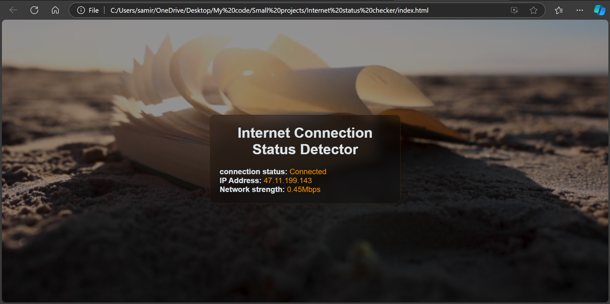

# Internet Status Checker

A simple web application to detect the current internet connection status, IP address, and network strength. The app provides real-time updates using JavaScript and displays this information in an intuitive and visually appealing interface.

## Features

- Detects whether the device is connected to the internet.
- Fetches and displays the user's public IP address.
- Displays the network connection strength in Mbps (if available).
- Simple and responsive user interface.
- Background video for visual appeal.

## Demo

## How It Works

The application uses the browser's `navigator.onLine` API to check the internet connection status. It fetches the public IP address using the [ipify](https://www.ipify.org/) API and attempts to display the network's downlink speed using `navigator.connection.downlink`.

### Dependencies

- [ipify API](https://www.ipify.org/) for fetching the public IP address.

